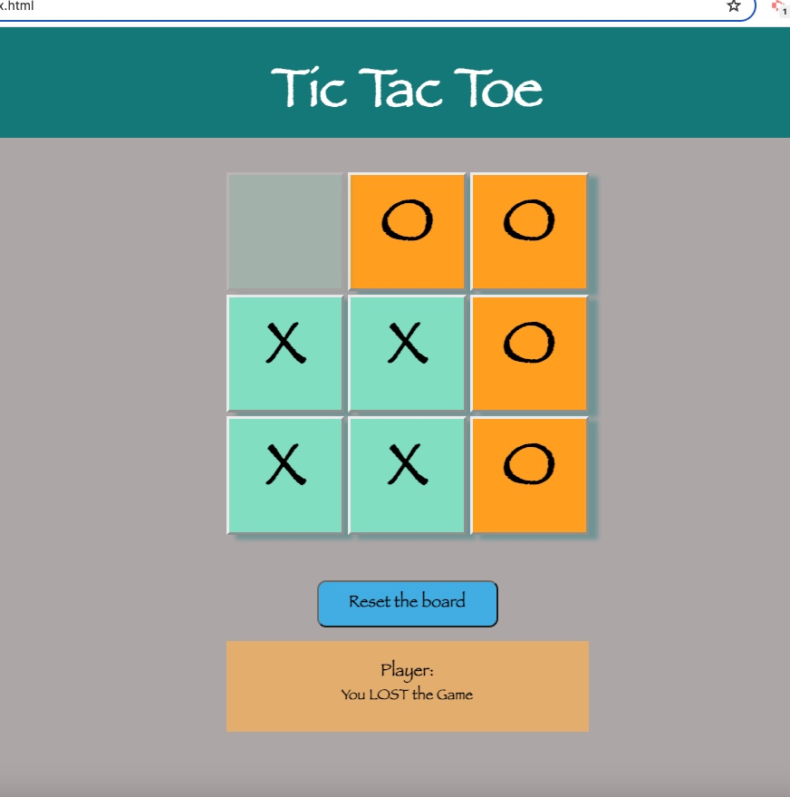

# Tic Tac Toe Game with Javascript

[](https://opensource.org/licenses/MIT)

## Description

This JavaScript-based Tic Tac Toe game allows a single player to play against the computer. The game is played on a 3x3 grid where players take turns placing their symbol (either 'X' or 'O') in empty cells. The objective is to be the first player to place three of their symbols in a horizontal, vertical, or diagonal row on the grid.

## Screenshot
<p align="center">
  
</p>

## Table of Contents 

  - [User Story](#use-story)
  - [Acceptance Criteria](#acceptance-criteria)
  - [Deployed Link](#deployed-link)
  - [Installation](#installation)
  - [License](#license)

## User Story

```md
AS A Player, 
I want to play a game of Tic Tac Toe against a computer opponent
So that I can enjoy a challenging single-player gaming experience.
```

## Acceptance Criteria

```md
GIVEN a Tic Tac Toe game
WHEN I open the browser or navigate to the game's URL
THEN I should see a welcome screen with a button to start the game.

WHEN I click the "Start Game" button,
THEN the game board should appear, displaying a 3x3 grid of empty cells for Tic Tac Toe.

WHEN the game starts,
THEN I am assigned the first turn with the symbol 'X', and I can click on any available cell to make my move.

WHEN I make a move by clicking on an empty cell,
THEN the computer opponent (playing as 'O') automatically makes its move on the next available empty cell.

WHEN the game continues,
THEN turns alternate between the player ('X') and the computer ('O') until there is a winner or all cells are filled.

WHEN a player wins by placing three of their symbols in a row (horizontal, vertical, or diagonal),
THEN the game announces the winner and offers an option to start a new game.

WHEN all cells are filled and no player has three symbols in a row,
THEN the game declares a draw/tie and provides an option to start a new game.

WHEN the game ends,
THEN I can click a button to start a new game, resetting the board and allowing me to play again.
```

## Deployed Link
- Github Repo: https://github.com/Najiba-Haidari/tic-tac-toe
- Github Deployed URL: https://najiba-haidari.github.io/tic-tac-toe/

## Installation
* Run/open the index.html in your browser
  
## License
This project is under the [](https://opensource.org/licenses/MIT)