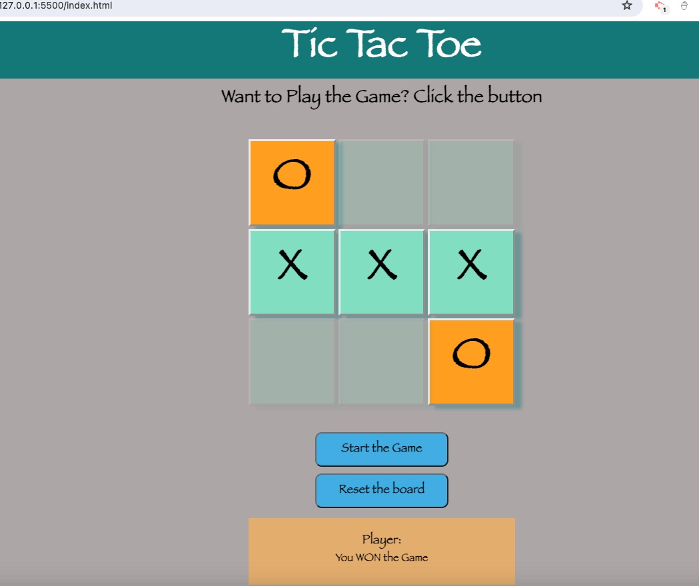

# Tic Tac Toe Game with Javascript

[](https://opensource.org/licenses/MIT)

## Description

This JavaScript-based Tic Tac Toe game allows a single player to play against the computer. The game is played on a 3x3 grid where players take turns placing their symbol (either 'X' or 'O') in empty cells. The objective is to be the first player to place three of their symbols in a horizontal, vertical, or diagonal row on the grid.

## Screenshot


## Table of Contents 

  - [User Story](#use-story)
  - [Acceptance Criteria](#acceptance-criteria)
  - [Deployed Link](#deployed-link)
  - [Installation](#installation)
  - [License](#license)

## User Story

```md
AS A Player, 
I want to play a game of Tic Tac Toe against a computer opponent
So that I can enjoy a challenging single-player gaming experience.
```

## Acceptance Criteria

```md
GIVEN a Tic Tac Toe game
WHEN I open the browser/URL
THEN I should see a page with a button to start the game
WHEN I run `npm run start` from the root directory
THEN I find that my application should start up the backend and serve the client
WHEN I run the text editor application from my terminal
THEN I find that my JavaScript files have been bundled using webpack
WHEN I run my webpack plugins
THEN I find that I have a generated HTML file, service worker, and a manifest file
WHEN I use next-gen JavaScript in my application
THEN I find that the text editor still functions in the browser without errors
WHEN I open the text editor
THEN I find that IndexedDB has immediately created a database storage
WHEN I enter content and subsequently click off of the DOM window
THEN I find that the content in the text editor has been saved with IndexedDB
WHEN I reopen the text editor after closing it
THEN I find that the content in the text editor has been retrieved from our IndexedDB
WHEN I click on the Install button
THEN I download my web application as an icon on my desktop
WHEN I load my web application
THEN I should have a registered service worker using workbox
WHEN I register a service worker
THEN I should have my static assets pre cached upon loading along with subsequent pages and static assets
WHEN I deploy to Heroku
THEN I should have proper build scripts for a webpack application
```

## Deployed Link
- Heroku URL: https://morning-plains-07430.herokuapp.com/
- Github Repo URL: https://najiba-haidari.github.io/pwa-text-editor/

## Installation
This app needs to be run in either CLI or shell.
* npm install
* npm run start:dev

  
## License
This project is under the [](https://opensource.org/licenses/MIT)